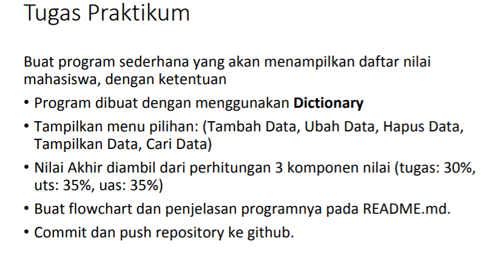
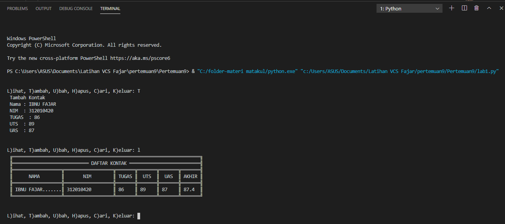
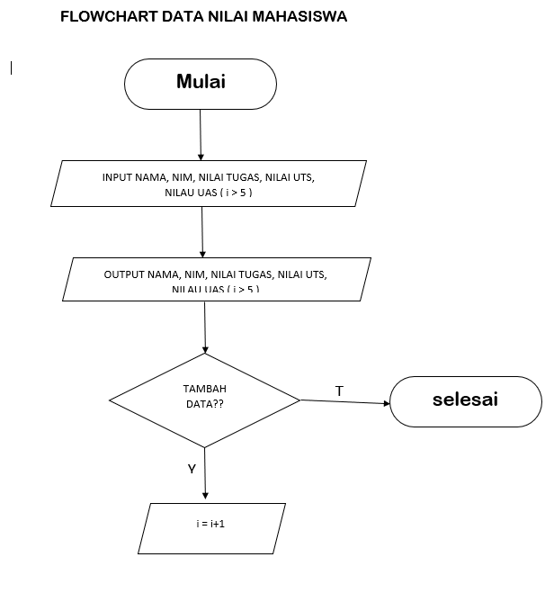
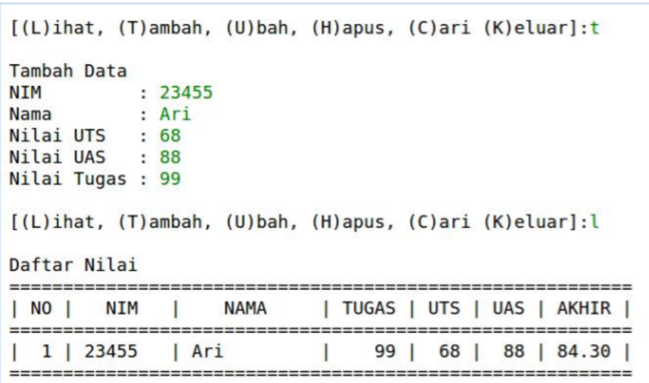

##  pertemuan9
##  Nama:IBNU FAJAR
## Kelas:TI.20.A1
## NIM:312010420
## MATKUL: BAHASA PEMROGRAMAN
___________________________________________________________________________________\
## Program Data Mahasiswa
pada praktikum 4 ini, saya akan membuat program sederhana untuk menginput data kedalam list.

 <br>

```python

## Berikut Inputannya :
nilai = []
ulang = True

while ulang:
    nama = input("Masukkan Nama: ")
    nim = input("Masukkan NIM: ")
    tugas = int(input("Masukkan Nilai Tugas: "))
    uts = int(input("Masukkan Nilai UTS: "))
    uas = int(input("Masukkan Nilai UAS: "))
    akhir = (tugas * 30/100) + (uts * 35/100) + (uas * 35/100)

    nilai.append([nama, nim, tugas, uts, uas, int(akhir)])
    if (input("Tambah data (y/t)?") == 't'):
        ulang = False

print("\n                      Daftar Nilai Mahasiswa")
print("==================================================================")
print("|No. |     Nama     |    NIM    | Tugas |  UTS  |  UAS  |  Akhir |")
print("==================================================================")
i = 0
for item in nilai:
    i += 1
    print("| {no:2d} | {nama:12s} | {nim:9s} | {tugas:5d} | {uts:5d} | {uas:5d} | {akhir:6.2f} |"
          .format(no=i, nama=item[0], nim=item[1], tugas=item[2], uts=item[3], uas=item[4], akhir=item[5]))
print("==================================================================")

```

Setelah Kita memasukan inputan dibawah ini ini lah hasil inputan Tersebut

 <br>
 
Dan Setelah Kita Menemukan Hasil Nya Mari Saya Jelaskan Perinciannya

1.) Langkah  Pertama  Yang Harus Lakukan Adalahkita membuat variable list kosong.

nilai = []
ulang = True
Variable ulang = True digunakan untuk mengontrol perulangan.

2.) Setelah itu  kita membuat kondisi perulangan dan statement yang akan dijalankan ketika perulangan terjadi.
    Dan Ini inputannya

     while ulang:
    nama = input("Masukkan Nama: ")
    nim = input("Masukkan NIM: ")
    tugas = int(input("Masukkan Nilai Tugas: "))
    uts = int(input("Masukkan Nilai UTS: "))
    uas = int(input("Masukkan Nilai UTS: "))
    akhir = (tugas * 30/100) + (uts * 35/100) + (uas * 35/100)

    nilai.append([nama, nim, tugas, uts, uas, int(akhir)])
 Dari statement  yang kita masukan diatas, kita akan diminta untuk menginput nama, nim, nilai tugas, nilai uts, dan nilai uas, lalu system akan menjumlahkan nilai-nilai tersebut dan menghasilkan nilai akhir. Setelah menginput berbagai data atau item, inputan item tersebut akan masuk ke dalam list 'nilai'
 3.) Setelah membuat perulangan, kita membuat statement untuk menghentikan atau keluar dari perulangan yang terjadi.

    if (input("Tambah data (y/t)?") == 't'):
        ulang = False
Untuk keluar dari perulangan kita hanya perlu menginputkan 't' apabila diminta pada saat program dijalankan. 't' akan membuat variable ulang = True menjadi ulang = False yang mana akan menghentikan perulangan yang terjadi.

4.) Terakhir kita akan mencetak hasil dari program yang telah dibuat.

```python

print("\n                      Daftar Nilai Mahasiswa")
print("==================================================================")
print("|No. |     Nama     |    NIM    | Tugas |  UTS  |  UAS  |  Akhir |")
print("==================================================================")
i = 0
for item in nilai:
    i += 1
    print("| {no:2d} | {nama:12s} | {nim:9s} | {tugas:5d} | {uts:5d} | {uas:5d} | {akhir:6.2f} |"
          .format(no=i, nama=item[0], nim=item[1], tugas=item[2], uts=item[3], uas=item[4], akhir=item[5]))
print("==================================================================")
Setelah ini selanjutnya kita akan membuat flowcart Sebagai Berikut

```

 <br>

## Pertemuan 9 Modul 5
Pada Pertemuan 9 Modul 5 dosen memberikan saya tugas untuk membuat program sederhana yang akan menampilkan daftar nilai mahasiswa. berikut soal yang dosen berikan:
 <br>
Penjelasan:
Penggunaan if c.lower() if c.lower() fungsinya apabila user menginputkan dengan huruf besar, maka otomatis akan menjadi huruf kecil sehingga kondisi yang diinginkan tercapai. contoh: <br>
```python 
if c.lower() == 'q'
```
Penggunaan while True while True berfungsi untuk mendeteksi jika format yang diinputkan bukan berupa type maka akan muncul eror
*Penggunaan else Fungsi else ialah jika tidak eror dan type yang dimasukan sesuai maka proses while True
Pengunaan valueError Fungsinya apabila diinputkan bukan berupa type maka hasilnya error (valueError)
berikut source codenya: <br>
```python
